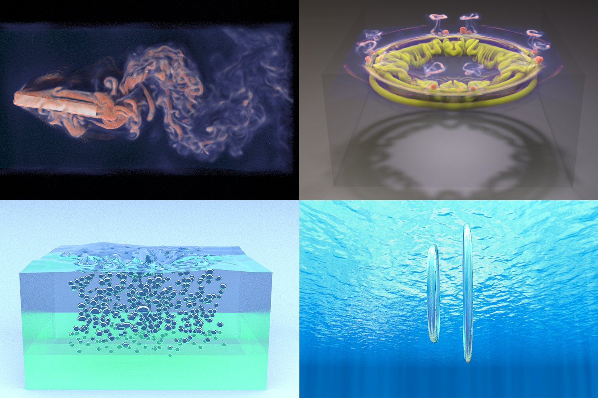
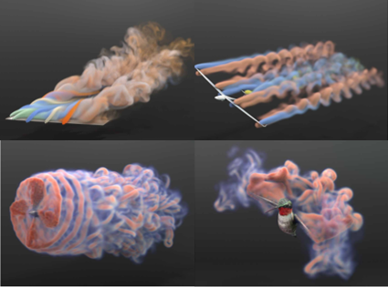
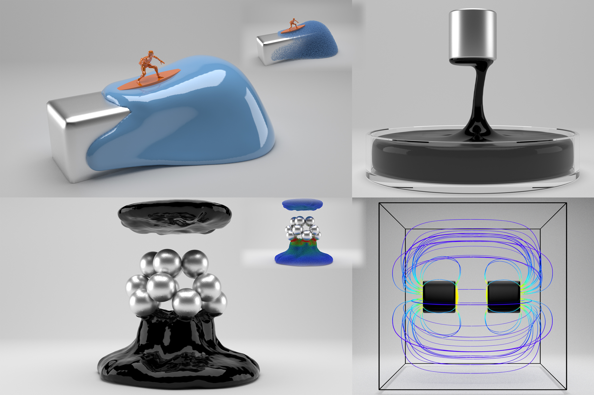

Hi there, I’m Yuchen! I’m a CS PhD student at GaTech, advised by Prof. [Bo Zhu](https://faculty.cc.gatech.edu/~bozhu/). Before that, I obtained my BSc in CS from Peking University. I was fortunate to work with Prof. [Baoquan Chen](https://baoquanchen.info/) during my undergraduate research.

My research interest lies in Computer Graphics, especially in Physical Simulation. My main focus is to develop high-performance and high-fidelity numerical algorithms to solve computational challenges associated with various kinds of physical systems.

## Research

  

    

      

        
      

      

        <b>An Impulse Ghost Fluid Method for Simulating Two-Phase Flows</b> 
        <i>ACM Transactions on Graphics (SIGGRAPH Asia 2024)</i> 
        <b>Yuchen Sun</b>, Linglai Chen, Weiyuan Zeng, Tao Du, Shiying Xiong, Bo Zhu 
        <a nonsmooth="1" href="https://yuchen-sun-eecs.github.io/projects/igfm/static/pdfs/SIG_Asia_2024_Impulse_Two_Phase_Flow.pdf" class="">Paper</a>
        <a nonsmooth="1" href="https://www.youtube.com/watch?v=MbEyyH2UB3s" class="">Video</a>
        <a nonsmooth="1" href="https://yuchen-sun-eecs.github.io/projects/igfm/" class="">Project Page</a>
      

    

     
    

      

        
      

      

        <b>Eulerian-Lagrangian Fluid Simulation on Particle Flow Maps</b> 
        <i>ACM Transactions on Graphics (SIGGRAPH 2024)</i> 
        Junwei Zhou, Duowen Chen, Molin Deng, Yitong Deng, <b>Yuchen Sun</b>, Sinan Wang, Shiying Xiong, Bo Zhu 
        <a nonsmooth="1" href="https://www.arxiv.org/pdf/2405.09672" class="">Paper</a>
        <a nonsmooth="1" href="https://www.youtube.com/watch?v=aErgFhxil7o" class="">Video</a>
        <a nonsmooth="1" href="https://zjw49246.github.io/projects/pfm/" class="">Project Page</a>
      

    

     
    

      

        
      

      

        <b>A Material Point Method for Nonlinearly Magnetized Materials</b> 
        <i>ACM Transactions on Graphics (SIGGRAPH Asia 2021)</i> 
        <b>Yuchen Sun*</b>, Xingyu Ni*, Bo Zhu, Bin Wang, Baoquan Chen 
        <a nonsmooth="1" href="https://yuchen-sun-eecs.github.io/projects/magnetic_mpm/static/pdfs/magnetic_mpm.pdf" class="">Paper</a>
        <a nonsmooth="1" href="https://www.youtube.com/watch?v=2zqJ1wvverA" class="">Video</a>
      

    

  

